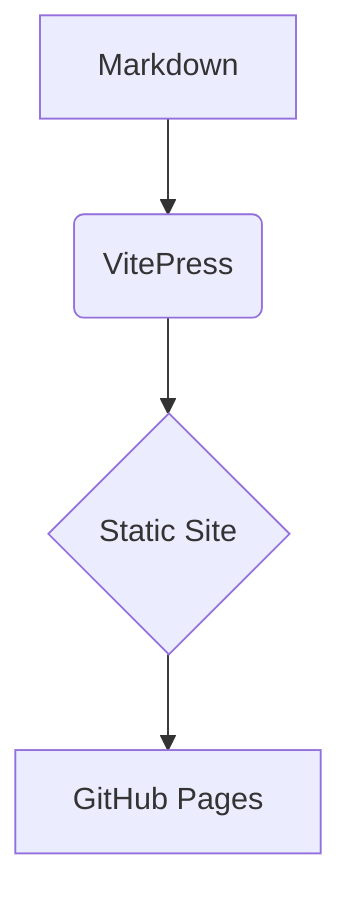

# 28 August 2025

List of Questoins I was asked on SFED Position

## General

-

<details>
<summary>(8) What kind of optimizations do you know?</summary>

Video optimization

React optimization

</details>

<details class="success">
  <summary>
    <span class="question">
      0: What are the core differences between Node.js and traditional server-side platforms like PHP or Java (Servlets), especially in terms of concurrency and execution model?
    </span>

  </summary>

  <p class="short-answer">
    The core difference between Node.js and traditional platforms like PHP or Java (Servlets) lies in their execution model and how they handle concurrent client requests.
  </p>

  1. Concurrency Model
  Aspect	Node.js	PHP / Java <span class="known">(Servlets)</span>
  Concurrency Model	Single-threaded + Non-blocking I/O	Multi-threaded (blocking by default)
  Execution	Event loop & callback-based	Each request handled by a new thread
  Thread Overhead	Low (one thread handles many requests)	High (one thread per request)
  Scalability	High for I/O-bound tasks	Limited by number of OS threads

  2. Performance Differences
  * Node.js excels at I/O-bound tasks: APIs, chat apps, streaming, real-time apps.
  * PHP/Java are better suited for CPU-intensive workloads where multithreading helps.

  3. Developer Paradigm
  * Node.js encourages async programming using callbacks, promises, or async/await.
  * PHP/Java are traditionally synchronous and blocking, though modern Java can use non-blocking patterns with frameworks like Spring WebFlux.

  4. Environment
  * Node.js runs JavaScript on the server with npm ecosystem.
  * PHP has its own runtime and ecosystem.
  * Java uses JVM and class-based OOP structures.

  <p class="conclusion">
    In summary, Node.js is optimized for handling many lightweight connections concurrently with minimal resource usage, while traditional servers rely on parallel threads, which are more resource-intensive.
  </p>

</details>

<details class="neutral">
  <summary>
    <span class="question">
      1: What are the core differences between Node.js and traditional server-side platforms like PHP or Java <span class="unknown">(Servlets)</span>, especially in terms of concurrency and execution model?
    </span>

  </summary>

  <p class="short-answer">
    The core difference between Node.js and traditional platforms like PHP or Java (Servlets) lies in their execution model and how they handle concurrent client requests.
  </p>
  1. Concurrency Model
  Aspect	Node.js	PHP / Java (Servlets)
  Concurrency Model	Single-threaded + Non-blocking I/O	Multi-threaded (blocking by default)
  Execution	Event loop & callback-based	Each request handled by a new thread
  Thread Overhead	Low (one thread handles many requests)	High (one thread per request)
  Scalability	High for I/O-bound tasks	Limited by number of OS threads

  2. Performance Differences
  * Node.js excels at I/O-bound tasks: APIs, chat apps, streaming, real-time apps.
  * PHP/Java are better suited for CPU-intensive workloads where multithreading helps.

  3. Developer Paradigm
  * Node.js encourages async programming using callbacks, promises, or async/await.
  * PHP/Java are traditionally synchronous and blocking, though modern Java can use non-blocking patterns with frameworks like Spring WebFlux.

  4. Environment
  * Node.js runs JavaScript on the server with npm ecosystem.
  * PHP has its own runtime and ecosystem.
  * Java uses JVM and class-based OOP structures.

  <p class="conclusion">
    In summary, Node.js is optimized for handling many lightweight connections concurrently with minimal resource usage, while traditional servers rely on parallel threads, which are more resource-intensive.
  </p>

</details>

<details class="failed">
  <summary>
    <span class="question">
      1: What are the core differences between Node.js and traditional server-side platforms like PHP or Java (Servlets), especially in terms of concurrency and execution model?
    </span>
  </summary>

  <p class="short-answer">
    The core difference between Node.js and traditional platforms like PHP or Java (Servlets) lies in their execution model and how they handle concurrent client requests.
  </p>
  1. Concurrency Model
  Aspect	Node.js	PHP / Java <span class="unknown">(Servlets)</span>
  Concurrency Model	Single-threaded + Non-blocking I/O	Multi-threaded (blocking by default)
  Execution	Event loop & callback-based	Each request handled by a new thread
  Thread Overhead	Low (one thread handles many requests)	High (one thread per request)
  Scalability	High for I/O-bound tasks	Limited by number of OS threads

  2. Performance Differences
  * Node.js excels at I/O-bound tasks: APIs, chat apps, streaming, real-time apps.
  * PHP/Java are better suited for CPU-intensive workloads where multithreading helps.

  3. Developer Paradigm
  * Node.js encourages async programming using callbacks, promises, or async/await.
  * PHP/Java are traditionally synchronous and blocking, though modern Java can use non-blocking patterns with frameworks like Spring WebFlux.

  4. Environment
  * Node.js runs JavaScript on the server with npm ecosystem.
  * PHP has its own runtime and ecosystem.
  * Java uses JVM and class-based OOP structures.

  <p class="conclusion">
    In summary, Node.js is optimized for handling many lightweight connections concurrently with minimal resource usage, while traditional servers rely on parallel threads, which are more resource-intensive.
  </p>

</details>


## Live coding

[1, 2, 3, 4, 5] -> [5, 4, 3, 2, 1]

## Build for production

```bash
npm run docs:build
npm run docs:preview
```


## Authoring basics

- Write pages in `docs/` using **Markdown** (`.md`).
- Add pages to the sidebar via `docs/.vitepress/config.ts`.
- Use callouts:

::: tip
This is a **tip** block.
:::

::: info
This is an **info** block.
:::

::: warning
This is a **warning** block.
:::

::: danger
This is a **danger** block.
:::


### Code groups (tabs)

::: code-group
```ts [TypeScript]
export const greet = (name: string) => `Hello, ${name}`
```
```js [JavaScript]
export const greet = (name) => `Hello, ${name}`
```
:::


### Mermaid diagrams

