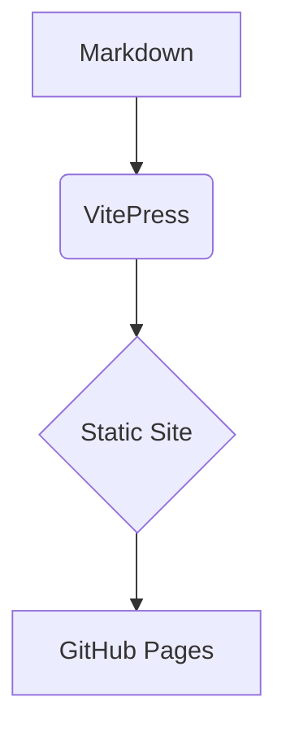

# 28 August 2025

List of Questoins I was asked on SFED Position

## General

-

<details>
<summary>(8) What kind of optimizations do you know?</summary>

Video optimization

React optimization

</details>


## Live coding

[1, 2, 3, 4, 5] -> [5, 4, 3, 2, 1]

## Build for production

```bash
npm run docs:build
npm run docs:preview
```


## Authoring basics

- Write pages in `docs/` using **Markdown** (`.md`).
- Add pages to the sidebar via `docs/.vitepress/config.ts`.
- Use callouts:

::: tip
This is a **tip** block.
:::

::: info
This is an **info** block.
:::

::: warning
This is a **warning** block.
:::

::: danger
This is a **danger** block.
:::


### Code groups (tabs)

::: code-group
```ts [TypeScript]
export const greet = (name: string) => `Hello, ${name}`
```
```js [JavaScript]
export const greet = (name) => `Hello, ${name}`
```
:::


### Mermaid diagrams

