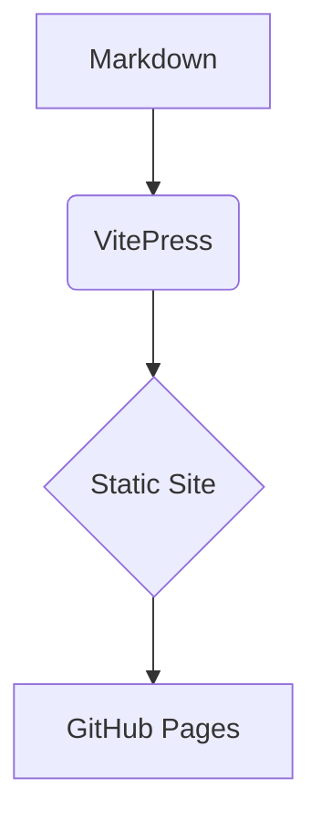

# Getting Started


Welcome! This guide will help you run the docs locally and deploy them.


## Prerequisites
- Node.js 18+ (or 20+ recommended)


## Install & run

```bash
npm i
npm run docs:dev
```

Open the local URL from your terminal.


## Build for production

```bash
npm run docs:build
npm run docs:preview
```


## Authoring basics

- Write pages in `docs/` using **Markdown** (`.md`).
- Add pages to the sidebar via `docs/.vitepress/config.ts`.
- Use callouts:

::: tip
This is a **tip** block.
:::

::: info
This is an **info** block.
:::

::: warning
This is a **warning** block.
:::

::: danger
This is a **danger** block.
:::


### Code groups (tabs)

::: code-group
```ts [TypeScript]
export const greet = (name: string) => `Hello, ${name}`
```
```js [JavaScript]
export const greet = (name) => `Hello, ${name}`
```
:::


### Mermaid diagrams



<details class="success">
  <summary>
    0: What are the core differences between Node.js and traditional server-side platforms like PHP or Java (Servlets), especially in terms of concurrency and execution model?
  </summary>

  <p class="short-answer">
    The core difference between Node.js and traditional platforms like PHP or Java (Servlets) lies in their execution model and how they handle concurrent client requests.
  </p>

  1. Concurrency Model
  Aspect	Node.js	PHP / Java <span class="known">(Servlets)</span>
  
  <p class="conclusion">
    In summary, Node.js is optimized for handling many lightweight connections concurrently with minimal resource usage, while traditional servers rely on parallel threads, which are more resource-intensive.
  </p>

</details>

<details class="neutral">
  <summary>
      1: What are the core differences between Node.js and traditional server-side platforms like PHP or Java (Servlets), especially in terms of concurrency and execution model?
  </summary>

  <p class="short-answer">
    The core difference between Node.js and traditional platforms like PHP or Java (Servlets) lies in their execution model and how they handle concurrent client requests.
  </p>
  1. Concurrency Model
  Aspect	Node.js	PHP / Java <span class="unknown">(Servlets)</span>

</details>

<details class="failed">
  <summary>
    <span class="question">
      1: What are the core differences between Node.js and traditional server-side platforms like PHP or Java (Servlets), especially in terms of concurrency and execution model?
    </span>
  </summary>

  <p class="short-answer">
    The core difference between Node.js and traditional platforms like PHP or Java (Servlets) lies in their execution model and how they handle concurrent client requests.
  </p>
  1. Concurrency Model
  Aspect	Node.js	PHP / Java <span class="unknown">(Servlets)</span>
  Concurrency Model	Single-threaded + Non-blocking I/O	Multi-threaded (blocking by default)

  <p class="conclusion">
    In summary, Node.js is optimized for handling many lightweight connections concurrently with minimal resource usage, while traditional servers rely on parallel threads, which are more resource-intensive.
  </p>

</details>