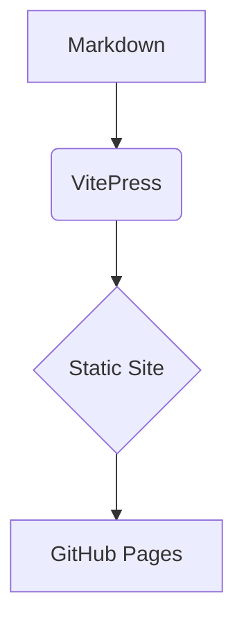

# Getting Started


Welcome! This guide will help you run the docs locally and deploy them.


## Prerequisites
- Node.js 18+ (or 20+ recommended)


## Install & run

```bash
npm i
npm run docs:dev
```

Open the local URL from your terminal.


## Build for production

```bash
npm run docs:build
npm run docs:preview
```


## Authoring basics

- Write pages in `docs/` using **Markdown** (`.md`).
- Add pages to the sidebar via `docs/.vitepress/config.ts`.
- Use callouts:

::: tip
This is a **tip** block.
:::

::: info
This is an **info** block.
:::

::: warning
This is a **warning** block.
:::

::: danger
This is a **danger** block.
:::


### Code groups (tabs)

::: code-group
```ts [TypeScript]
export const greet = (name: string) => `Hello, ${name}`
```
```js [JavaScript]
export const greet = (name) => `Hello, ${name}`
```
:::


### Mermaid diagrams

